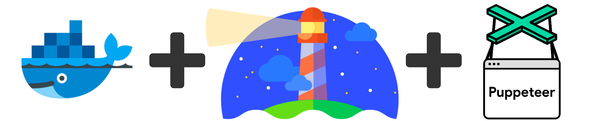

Lighthouse Puppeteer - NPM Package
==================================

[](http://github.com/femtopixel/google-lighthouse-puppeteer/releases)
[](https://www.npmjs.com/package/google-lighthouse-puppeteer)
[](https://www.paypal.me/jaymoulin)
[](https://www.buymeacoffee.com/jaymoulin)
[](https://patreon.com/jaymoulin)

DISCLAIMER: As-of 2021, this product does not have a free support team anymore. If you want this product to be maintained, please support on Patreon.

(This product is available under a free and permissive license, but needs financial support to sustain its continued improvements. In addition to maintenance and stability there are many desirable features yet to be added.)

* [Google Chrome Headless](https://developers.google.com/web/updates/2017/04/headless-chrome) is the Google Chrome browser that can be started without graphical interface to accomplish several tasks (PDF printing, performance, automation...)
* [Google Lighthouse](https://developers.google.com/web/tools/lighthouse/) analyzes web apps and web pages, collecting modern performance metrics and insights on developer best practices.
* [Google Puppeteer](https://github.com/GoogleChrome/puppeteer) is a tool to automate tasks on a Chrome (headless) browser.

Description
-----------

The purpose of this package image is to produce performance report for several pages in connected mode and in an automated (programmated) way.

It uses [lighthouse-batch](https://github.com/mikestead/lighthouse-batch) to be able to automate export of multiple

### Installation

```
npm install -g google-lighthouse-puppeteer --unsafe-perm=true
```

### CLI Usage

```
$> lighthouse-puppeteer -h

Options

  -f, --file FILE         Path to your testcase REQUIRED (default option)
                          (example: /home/chrome/testcases/mytestcase.js)
  -p, --port PORT         Chrome headless debug port (default: 9222)
  -c, --chromium_params   Optional parameters to pass to chrome/chromium browser
                            (https://peter.sh/experiments/chromium-command-line-switches/)
                            (example: "--no-sandbox --disable-setuid-sandbox --ssl-version-max=tls1.1")
  -v, --verbose           The more you add, the more it show information
  -h, --help              Print this usage guide.

Lighthouse

  -d, --output_directory FOLDER   Path to output reports
                                  (default: /home/chrome/reports)
  -w, --html                      Renders HTML reports alongside JSON reports
  -l, --lighthouse_params         Optional parameters to pass to lighthouse
                                  (https://github.com/GoogleChrome/lighthouse/#cli-options)
                                  (example: "--quiet --perf")

Puppeteer

  You can add your options for puppeteer by prefixing them with --puppeteer-
  (https://github.com/GoogleChrome/puppeteer/blob/master/docs/api.md#puppeteerlaunchoptions)

  example: "--puppeteer-ignoreHTTPSErrors --puppeteer-slowMo 20"
```

### Docker

You can see https://github.com/femtopixel/docker-google-lighthouse-puppeteer or https://hub.docker.com/r/femtopixel/google-lighthouse-puppeteer for more informations.

### Environment

If you want to use your own Chrome/Chromium instead of the provided by Puppeteer, you can add the following two environment variables:

```bash
# This environment is used by puppeteer to know where your chrome browser installed in located
CHROME_PATH=/usr/bin/chromium-browser
# This environment tells puppeteer and npm to not install the browser in node_modules
PUPPETEER_SKIP_CHROMIUM_DOWNLOAD=true
```

### Package Usage

```javascript
const lp = require('google-lighthouse-puppeteer');
const options = {};
lp.exec('/path/to/my/test.js', options)
    .then(() => console.log('everything ok'))
    .catch((err) => console.error(err));
```
### Options

You can change some options like in CLI :

```json
{
    "main": {
      "port":9222,
      "verbose":[true, true]
    },
    "lighthouse": {
        "params":"",
        "output_directory":"/home/chrome/reports",
        "lighthouse_params":""
    },
    "chromium": "--no-sandbox --disable-setuid-sandbox --ssl-version-max=tls1.1",
    "_unknown": [
        "--puppeteer-ignoreHTTPSErrors",
        "--puppeteer-slowMo",
        "20"
    ]
}
```

For puppeteer, all params must be added in the `_unknown` entry and are prefixed with `--puppeteer-`. Each value must be in separated entry.

`verbose` is an array of true, the more `true` the more talkative the application.

Lighthouse params can be added respecting [their documentation](https://github.com/GoogleChrome/lighthouse/#cli-options)

### API

You should create a testcase file named `whateverYouWant.js`.

This file must `module.exports` an object which must contain two methods : `connect` and `getUrls`.

#### connect

This method must return a `Promise` which resolves the browser (first argument received of the method connect).

The purpose of this method is to connect the user to the browser.

#### getUrls

This method must return an array of string for the url to be tested. You can put url restricted by connection since the `connect` method will grant you access.

#### Implementation

```js
class whateverYouWant
{
    getUrls() {
        return [
           "https://myawsome.site/admin/heavypage",
           "https://myawsome.site/admin/lightpage",
       ];
    }

    connect(browser) {
        return new Promise(async (resolve, reject) => {
            const page = await browser.newPage();
            await page.goto('https://myawesome.site/admin/authentication', {waitUntil: 'load'});
            await page.type('#login', 'admin');
            await page.type('#password', 'admin');
            await page.$eval('#form input[type=submit]', x => x.click());
            await page.waitForNavigation({waitUntil: 'networkidle2'});
            resolve(browser);
        });
    }
}

module.exports = new whateverYouWant();
``` 
